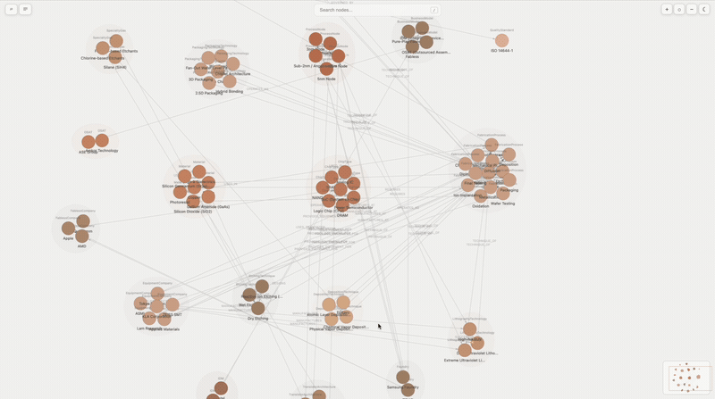

# Backpack Viewer

**See your learning graph.** A web-based visualizer for [Backpack](https://www.npmjs.com/package/backpack-ontology) learning graphs with force-directed layout, interactive navigation, and live reload.



## Quick start

Tell Claude:

> "Show me my learning graph"

Or run it directly:

```bash
npx backpack-viewer
```

Opens http://localhost:5173. Click any learning graph in the sidebar to visualize it.

**Using Claude Code?** The [backpack-ontology-plugin](https://github.com/NoahIrzinger/backpack-ontology-plugin) bundles the MCP server with usage skills (`backpack-guide`, `backpack-mine`) and is the recommended install path. The viewer works against whatever backpack data the plugin or standalone MCP writes, no extra wiring needed.

## Features

### Exploration
- **Live reload** — add knowledge via Claude and watch it appear in real time
- **Pan and zoom** — click-drag to pan, scroll to zoom
- **Focus mode** — select nodes and isolate their N-hop subgraph
- **Walk mode** — traverse the graph node-by-node with a highlighted trail
- **Path finding** — select two nodes, shortest path highlighted
- **Search** — filter by name in the sidebar, filter by type with chips
- **Node history** — back/forward navigation through inspected nodes
- **Graph snippets** — save walk trails as named, reusable subgraphs

### Editing
- **Inspect** — click any item to see properties, connections, and metadata
- **Inline edit** — rename graphs, change node types and properties, add/remove items
- **Star nodes** — mark important nodes with a gold star indicator

### Collaboration awareness (0.3.0+)
- **Lock heartbeat badge** — each graph in the sidebar shows `editing: <author>` when another writer is actively editing (within the last 5 minutes). Backed by a batched `/api/locks` endpoint.
- **Remote graphs section** — subscribe to learning graphs hosted at HTTPS URLs and view them read-only alongside your local graphs.

### Versioning
- **Branches and snapshots** — the underlying storage is event-sourced; the viewer exposes branch switching and snapshot/rollback UI via the MCP tools.

## How it works

The viewer reads learning graph data from the same local event log that the MCP server writes to. Changes appear automatically, no refresh needed.

```
backpack-ontology (MCP) ──writes──> ~/.local/share/backpack/graphs/<name>/
                                         │  branches/<branch>/events.jsonl
                                         │  branches/<branch>/snapshot.json
backpack-viewer ──reads──────────────────┘
```

Old-format graphs (pre-0.3.0) are migrated automatically on MCP startup — the viewer reads the new format on first launch after upgrade, no manual step.

## Configuration

The viewer reads an optional config file for customizing keybindings and other settings. The config file follows the [XDG Base Directory](https://specifications.freedesktop.org/basedir-spec/latest/) convention:

```
~/.config/backpack/viewer.json
```

Override with environment variables:
- `$XDG_CONFIG_HOME/backpack/viewer.json`
- `$BACKPACK_DIR/config/viewer.json`

### Keybindings

Create `~/.config/backpack/viewer.json` and override any binding. Unspecified keys keep their defaults.

```json
{
  "keybindings": {
    "search": "s",
    "focus": "g",
    "panLeft": "a",
    "panDown": "s",
    "panUp": "w",
    "panRight": "d"
  }
}
```

### Available actions

| Action | Default | Description |
|---|---|---|
| `search` | `/` | Focus the search bar |
| `searchAlt` | `ctrl+k` | Focus the search bar (alternate) |
| `undo` | `ctrl+z` | Undo last edit |
| `redo` | `ctrl+shift+z` | Redo last edit |
| `help` | `?` | Toggle keyboard shortcuts help |
| `escape` | `Escape` | Exit focus mode or close panel |
| `focus` | `f` | Focus on selected nodes / exit focus |
| `toggleEdges` | `e` | Toggle edge visibility |
| `center` | `c` | Center view on the graph |
| `nextNode` | `.` | Cycle to next node in view |
| `prevNode` | `,` | Cycle to previous node in view |
| `nextConnection` | `>` | Cycle to next connection in info panel |
| `prevConnection` | `<` | Cycle to previous connection in info panel |
| `historyBack` | `(` | Go back in node inspection history |
| `historyForward` | `)` | Go forward in node inspection history |
| `hopsIncrease` | `=` | Increase hops in focus mode |
| `hopsDecrease` | `-` | Decrease hops in focus mode |
| `panLeft` | `h` | Pan camera left |
| `panDown` | `j` | Pan camera down |
| `panUp` | `k` | Pan camera up |
| `panRight` | `l` | Pan camera right |
| `panFastLeft` | `H` | Pan camera left (fast) |
| `panFastRight` | `L` | Pan camera right (fast) |
| `zoomIn` | `K` | Zoom in |
| `zoomOut` | `J` | Zoom out |
| `spacingDecrease` | `[` | Decrease node spacing |
| `spacingIncrease` | `]` | Increase node spacing |
| `clusteringDecrease` | `{` | Decrease type clustering |
| `clusteringIncrease` | `}` | Increase type clustering |

### Binding format

Bindings are strings with optional modifier prefixes separated by `+`:

- Single keys: `"f"`, `"/"`, `"?"`, `"Escape"`
- With modifiers: `"ctrl+z"`, `"ctrl+shift+z"`, `"alt+s"`
- `ctrl` and `cmd`/`meta` are treated as equivalent (works on both Mac and Linux)

## Reference

| Variable | Effect |
|---|---|
| `PORT` | Override the default port (default: `5173`) |
| `XDG_CONFIG_HOME` | Override config location (default: `~/.config`) |
| `XDG_DATA_HOME` | Override data location (default: `~/.local/share`) |
| `BACKPACK_DIR` | Override both config and data directories |

## Support

Questions, feedback, or partnership inquiries: **support@backpackontology.com**

## Privacy

See the [Privacy Policy](https://github.com/noahirzinger/backpack-ontology/blob/main/PRIVACY.md). The viewer itself collects no data.

## License

Licensed under the [Apache License, Version 2.0](./LICENSE).
